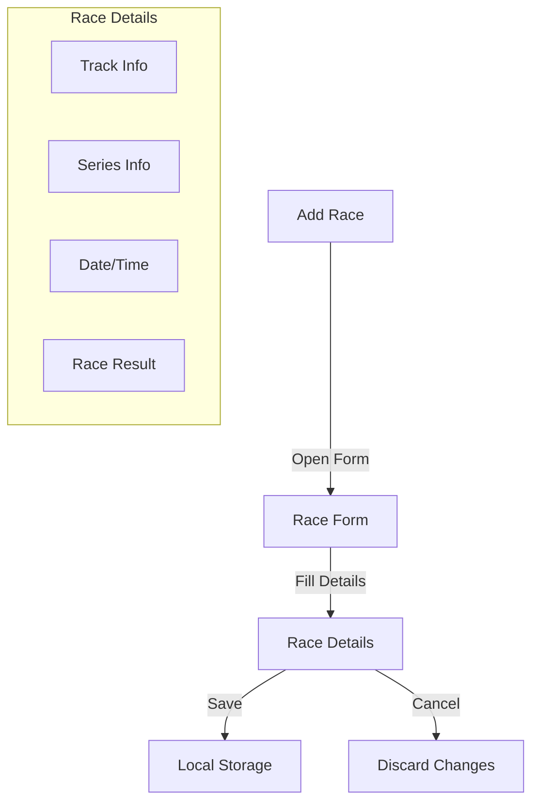
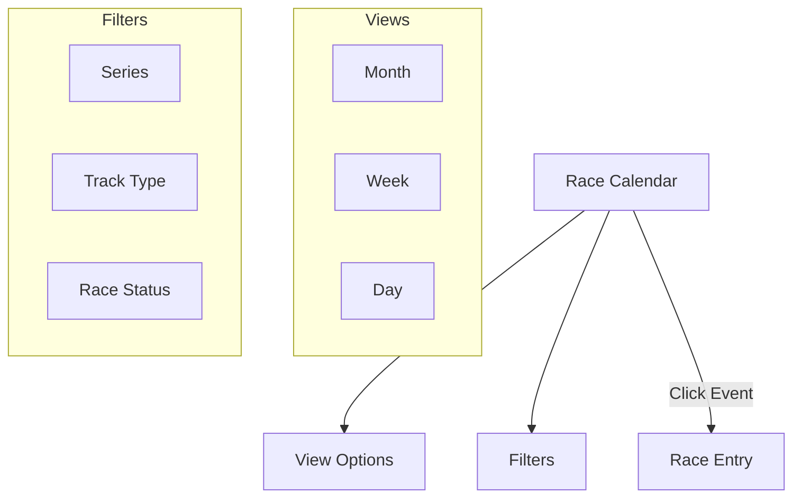
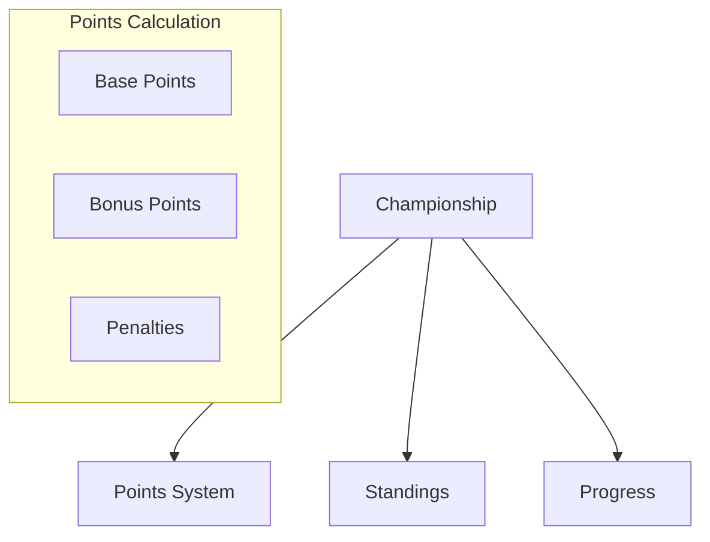

# Race Management

## Overview

The Race Management feature allows users to track, add, edit, and analyze their iRacing race entries. This document details the functionality and usage of race management features.

## Features

### 1. Race Entry



#### Required Fields
- Date and Time
- Series
- Track
- Vehicle
- Week Number
- Season Number

#### Optional Fields
- Start Position
- Finish Position
- Championship Points
- Incident Points
- Best Lap Time
- Laps Completed

### 2. Race Calendar



### 3. Race History

The Race History view provides a comprehensive overview of past races with:
- Filtering capabilities
- Sorting options
- Export functionality
- Detailed statistics

### 4. Championship Tracking



## Implementation Details

### Data Structure

```typescript
interface RaceEntry {
  id: string;
  date: string;
  series: string;
  track: {
    name: string;
    type: 'oval' | 'road';
  };
  vehicle: string;
  result?: {
    startPosition: number;
    finishPosition: number;
    championshipPoints: number;
    incidentPoints: number;
    bestLapTime?: number;
    lapsCompleted?: number;
  };
  status: 'upcoming' | 'completed';
  week: number;
  season: number;
  championshipStanding?: {
    position: number;
    points: number;
    droppedWeeks?: number[];
  };
}
```

### State Management

```typescript
// Race Slice
interface RaceState {
  entries: RaceEntry[];
  loading: boolean;
  error: string | null;
  filters: RaceFilters;
  selectedRace: string | null;
}

// Actions
const raceSlice = createSlice({
  name: 'races',
  initialState,
  reducers: {
    addRace: (state, action: PayloadAction<RaceEntry>) => {
      state.entries.push(action.payload);
    },
    updateRace: (state, action: PayloadAction<RaceEntry>) => {
      const index = state.entries.findIndex(r => r.id === action.payload.id);
      if (index !== -1) {
        state.entries[index] = action.payload;
      }
    },
    // ... other reducers
  }
});
```

## Usage Examples

### Adding a New Race

```typescript
// Component usage
function RaceForm({ onSubmit }: RaceFormProps) {
  const [formData, setFormData] = useState<RaceEntry>({
    // ... initial state
  });

  const handleSubmit = (e: React.FormEvent) => {
    e.preventDefault();
    onSubmit(formData);
  };

  return (
    <form onSubmit={handleSubmit}>
      {/* Form fields */}
    </form>
  );
}
```

### Filtering Races

```typescript
// Hook usage
function useRaceFilters() {
  const [filters, setFilters] = useState<RaceFilters>({
    series: null,
    trackType: null,
    status: null,
    dateRange: null,
  });

  const filteredRaces = useMemo(() => {
    return races.filter(race => {
      // Apply filters
      return true; // or false based on filters
    });
  }, [races, filters]);

  return { filters, setFilters, filteredRaces };
}
```

## Best Practices

1. **Data Validation**
   - Validate all user inputs
   - Ensure required fields are filled
   - Validate date ranges
   - Check for duplicate entries

2. **Performance**
   - Use pagination for large datasets
   - Implement virtual scrolling
   - Memoize filtered results
   - Optimize re-renders

3. **Error Handling**
   - Display user-friendly error messages
   - Provide recovery options
   - Log errors for debugging
   - Handle edge cases

4. **User Experience**
   - Provide immediate feedback
   - Implement undo/redo
   - Add confirmation dialogs
   - Show loading states

## Troubleshooting

Common issues and solutions:

1. **Race Not Saving**
   - Check required fields
   - Verify storage quota
   - Check for validation errors
   - Ensure unique ID generation

2. **Calendar Not Updating**
   - Clear filters
   - Refresh view
   - Check date ranges
   - Verify data loading

3. **Championship Points**
   - Verify points calculation
   - Check dropped weeks
   - Validate season boundaries
   - Review race status 