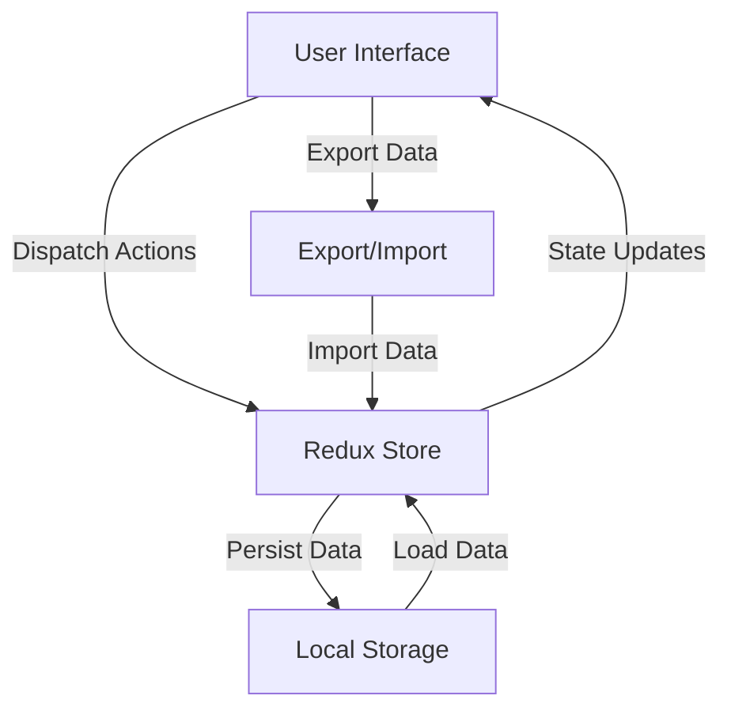
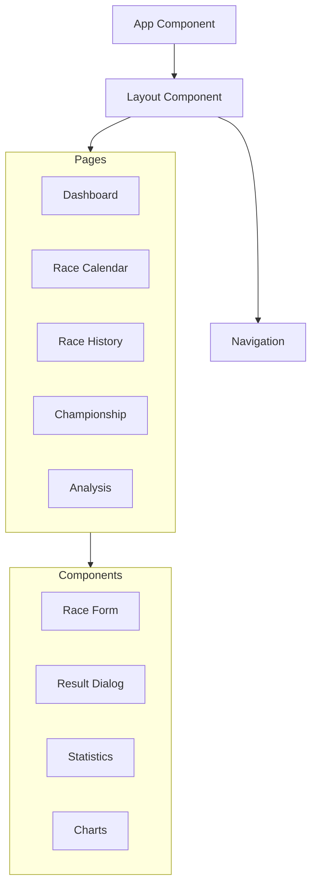
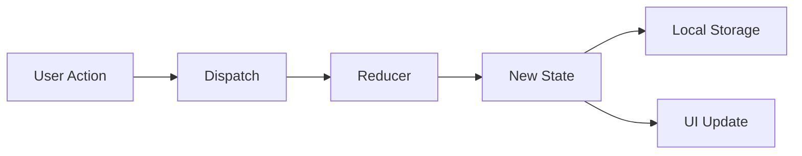
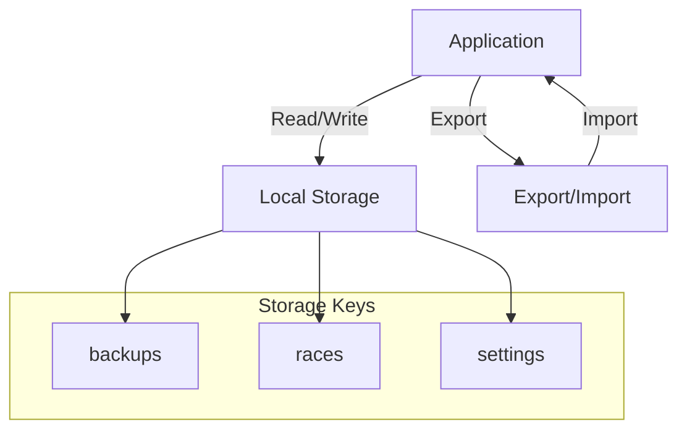
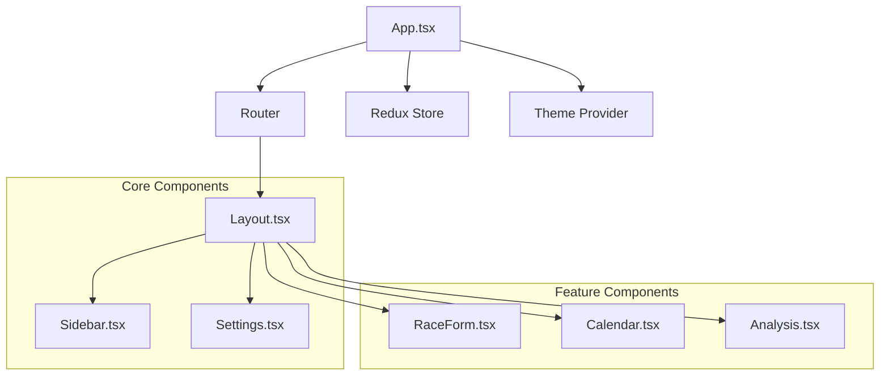

# Application Architecture

## Overview

The iRacing Stat Tracker is a client-side application built with React and TypeScript. This document outlines the application's architecture, data flow, and component relationships.

## Data Flow Diagram

## Component Architecture

## State Management Flow

## Data Storage Architecture

## Component Dependencies

