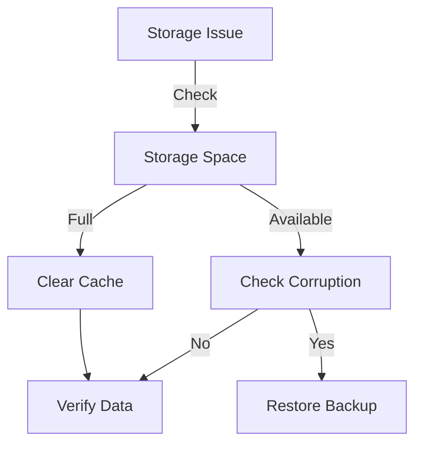
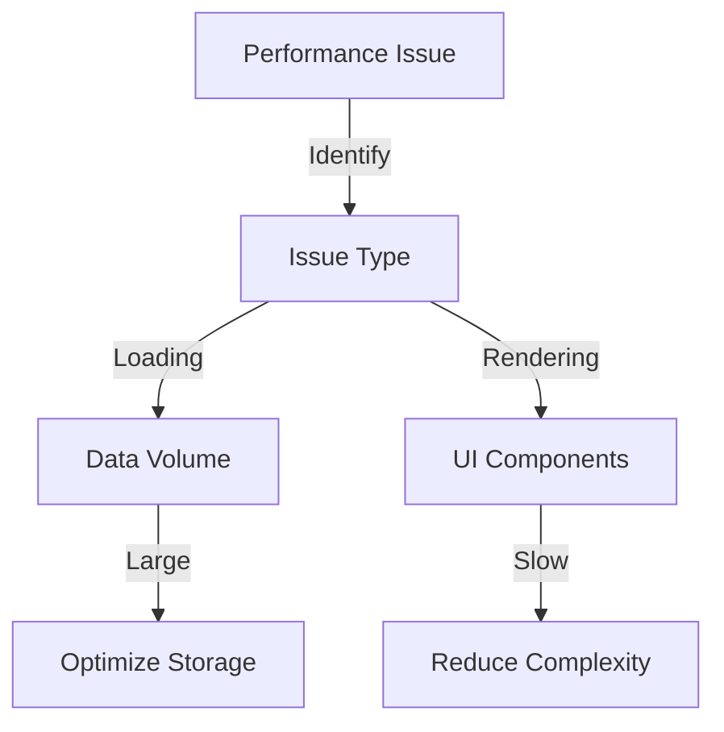
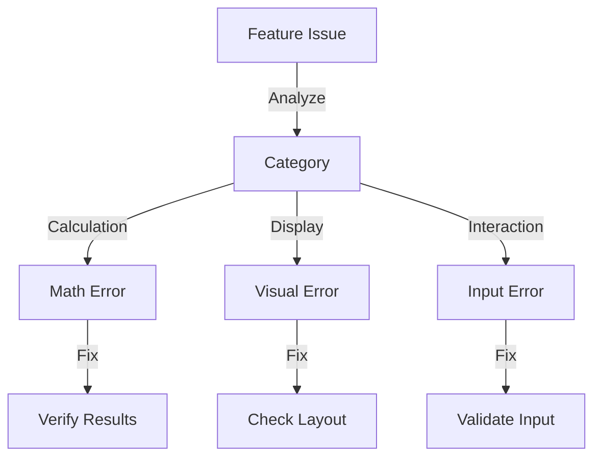
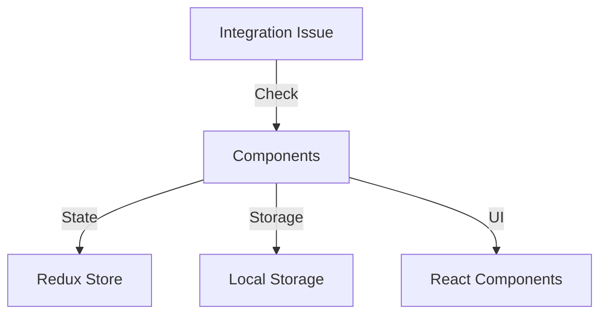

# Troubleshooting Guide

## Overview

This guide provides solutions for common issues you might encounter while using the iRacing Stat Tracker application. Follow the diagnostic steps for each issue to resolve problems quickly.

## Common Issues

### 1. Data Storage Issues



#### Symptoms
- Data not saving
- Missing race entries
- Corrupted statistics
- Export/Import failures

#### Solutions
1. **Check Storage Space**
   - Open browser dev tools
   - Navigate to Application > Storage
   - Verify available space
   - Clear unnecessary data

2. **Data Corruption**
   - Export current data as backup
   - Clear local storage
   - Import backup data
   - Verify data integrity

3. **Browser Issues**
   - Try different browser
   - Clear browser cache
   - Check browser version
   - Disable extensions

### 2. Performance Problems



#### Symptoms
- Slow loading times
- Unresponsive UI
- High memory usage
- Delayed updates

#### Solutions
1. **Data Volume**
   - Archive old seasons
   - Use pagination
   - Implement lazy loading
   - Optimize queries

2. **UI Performance**
   - Reduce active components
   - Implement virtualization
   - Optimize re-renders
   - Use web workers

3. **Browser Resources**
   - Monitor memory usage
   - Check CPU utilization
   - Reduce background tasks
   - Clear browser data

### 3. Feature Functionality



#### Championship Calculations
1. **Points Not Adding Up**
   ```typescript
   // Debug points calculation
   function debugPointsCalculation(race: RaceResult) {
     console.log({
       basePoints: calculateBasePoints(race),
       bonus: calculateBonusPoints(race),
       penalties: calculatePenalties(race),
       total: calculateTotalPoints(race)
     });
   }
   ```

2. **Incorrect Standings**
   ```typescript
   // Verify standings calculation
   function verifyStandings(results: RaceResult[]) {
     const standings = calculateStandings(results);
     const validation = validateStandingsOrder(standings);
     console.log('Standings Validation:', validation);
     return validation.isValid;
   }
   ```

#### Race Data Entry
1. **Form Validation**
   ```typescript
   // Validate race entry data
   function validateRaceEntry(entry: RaceEntry): ValidationResult {
     const errors = [];
     if (!entry.date) errors.push('Date is required');
     if (!entry.series) errors.push('Series is required');
     // ... more validation
     return {
       isValid: errors.length === 0,
       errors
     };
   }
   ```

2. **Data Format**
   ```typescript
   // Format validation
   function validateDataFormat(data: any): boolean {
     const schema = getRaceEntrySchema();
     return validateAgainstSchema(data, schema);
   }
   ```

### 4. Integration Issues



#### Component Communication
1. **State Management**
   ```typescript
   // Debug state changes
   function debugStateChanges(action: Action) {
     console.log('Previous State:', store.getState());
     console.log('Action:', action);
     console.log('Next State:', store.getState());
   }
   ```

2. **Props Validation**
   ```typescript
   // Validate component props
   interface ComponentProps {
     data: RaceData;
     onUpdate: (data: RaceData) => void;
   }
   
   function validateProps(props: ComponentProps): boolean {
     return (
       props.data !== undefined &&
       typeof props.onUpdate === 'function'
     );
   }
   ```

## Diagnostic Tools

### 1. Data Validator

```typescript
// Data integrity checker
class DataValidator {
  static validateStorage(): ValidationResult {
    return {
      isValid: boolean,
      errors: string[],
      warnings: string[]
    };
  }

  static validateRaceData(races: RaceEntry[]): ValidationResult {
    // Implement validation logic
  }

  static validateChampionship(championship: Championship): ValidationResult {
    // Implement validation logic
  }
}
```

### 2. Performance Monitor

```typescript
// Performance monitoring
class PerformanceMonitor {
  static measureOperation(operation: () => void): PerformanceMetrics {
    const start = performance.now();
    operation();
    const end = performance.now();
    
    return {
      duration: end - start,
      timestamp: new Date(),
      operation: operation.name
    };
  }

  static analyzePerformance(metrics: PerformanceMetrics[]): PerformanceReport {
    // Generate performance report
  }
}
```

## Recovery Procedures

### 1. Data Recovery

```typescript
// Data recovery utilities
class DataRecovery {
  static async backupData(): Promise<string> {
    const data = await getAllData();
    return JSON.stringify(data);
  }

  static async restoreData(backup: string): Promise<boolean> {
    try {
      const data = JSON.parse(backup);
      await validateAndRestore(data);
      return true;
    } catch (error) {
      console.error('Restore failed:', error);
      return false;
    }
  }
}
```

### 2. State Reset

```typescript
// Application state reset
function resetApplicationState() {
  // Clear redux store
  store.dispatch({ type: 'RESET_STATE' });
  
  // Clear local storage
  localStorage.clear();
  
  // Reset UI components
  resetUIComponents();
}
```

## Best Practices

1. **Regular Maintenance**
   - Backup data regularly
   - Clean old data
   - Update dependencies
   - Monitor performance

2. **Error Prevention**
   - Validate all inputs
   - Handle edge cases
   - Use type checking
   - Implement safeguards

3. **Debugging**
   - Use console logging
   - Check browser console
   - Monitor network requests
   - Review error logs

4. **Recovery**
   - Keep backups
   - Document changes
   - Test restoration
   - Maintain versions

## Support Resources

1. **Documentation**
   - User guides
   - API references
   - Code examples
   - Best practices

2. **Community**
   - GitHub issues
   - Discussion forums
   - Feature requests
   - Bug reports

3. **Development**
   - Source code
   - Test cases
   - Build scripts
   - Deployment guides 