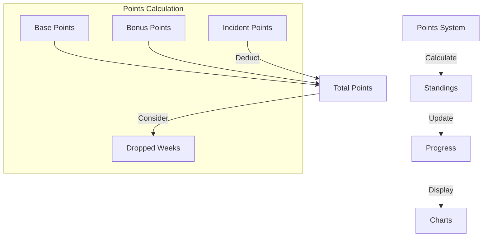
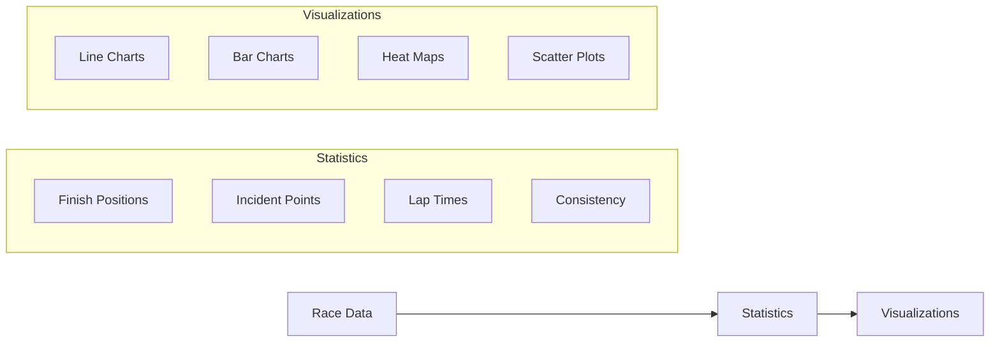
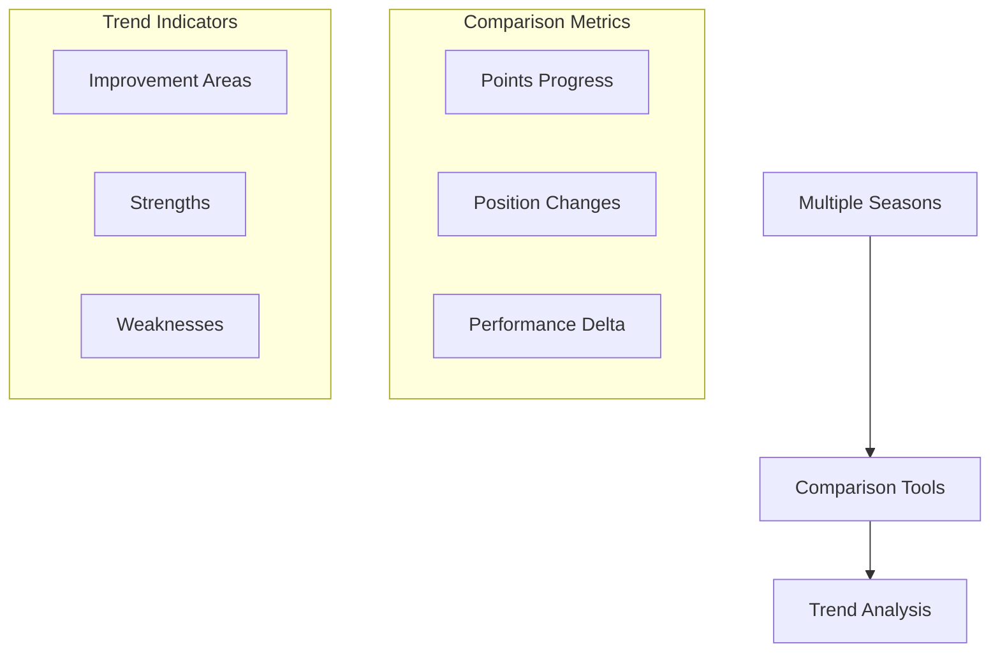

# Championship Analysis

## Overview

The Championship Analysis feature provides comprehensive tools for analyzing racing performance, tracking championship progress, and visualizing statistics across multiple race series and seasons.

## Features

### 1. Championship Points Tracking



#### Points System
- Base points for finishing position
- Bonus points for pole position/fastest lap
- Incident point deductions
- Dropped week calculations
- Season-specific point structures

### 2. Performance Analytics



#### Available Metrics
- Average finish position
- Incident rate
- Best/worst finishes
- Consistency score
- Championship position over time
- Points per race
- Track-specific performance

### 3. Season Comparison



## Implementation Details

### Data Structures

```typescript
interface ChampionshipStanding {
  seasonId: string;
  seriesId: string;
  driverId: string;
  points: number;
  position: number;
  raceResults: RaceResult[];
  droppedWeeks: number[];
  bonusPoints: number;
  penaltyPoints: number;
}

interface SeasonStats {
  averageFinish: number;
  bestFinish: number;
  worstFinish: number;
  poles: number;
  wins: number;
  podiums: number;
  averageIncidents: number;
  consistencyScore: number;
  improvementRate: number;
}

interface PerformanceMetrics {
  trackType: 'oval' | 'road';
  averageLapTime: number;
  bestLapTime: number;
  incidentRate: number;
  completionRate: number;
  positionsGained: number;
}
```

### Analysis Methods

```typescript
// Points Calculation
function calculateChampionshipPoints(results: RaceResult[]): number {
  return results.reduce((total, race) => {
    const basePoints = getBasePoints(race.finishPosition);
    const bonus = calculateBonusPoints(race);
    const penalties = calculatePenalties(race);
    return total + basePoints + bonus - penalties;
  }, 0);
}

// Performance Analysis
function analyzePerformanceTrend(
  results: RaceResult[],
  windowSize: number
): TrendAnalysis {
  // Calculate moving averages and trends
  return {
    trend: 'improving' | 'declining' | 'stable',
    confidence: number,
    metrics: PerformanceMetrics
  };
}

// Season Comparison
function compareSeasons(
  season1: SeasonStats,
  season2: SeasonStats
): SeasonComparison {
  return {
    pointsDelta: number,
    performanceDeltas: {
      finish: number,
      incidents: number,
      consistency: number
    },
    significantChanges: string[]
  };
}
```

## Usage Examples

### Analyzing Championship Progress

```typescript
// Hook usage
function useChampionshipAnalysis(seasonId: string) {
  const [analysis, setAnalysis] = useState<ChampionshipAnalysis>();
  
  useEffect(() => {
    const results = getRaceResults(seasonId);
    const standings = calculateStandings(results);
    const trends = analyzePerformanceTrend(results, 5);
    
    setAnalysis({
      currentPosition: standings.position,
      pointsToNext: standings.pointsToNext,
      recentTrend: trends,
      projectedFinish: calculateProjection(standings, trends)
    });
  }, [seasonId]);
  
  return analysis;
}
```

### Visualizing Performance

```typescript
// Component usage
function PerformanceChart({ data, metric }: ChartProps) {
  const chartData = useMemo(() => {
    return processDataForChart(data, metric);
  }, [data, metric]);

  return (
    <LineChart
      data={chartData}
      xAxis={{ title: 'Race Number' }}
      yAxis={{ title: getMetricLabel(metric) }}
      series={[
        {
          name: 'Actual',
          data: chartData.actual
        },
        {
          name: 'Trend',
          data: chartData.trend
        }
      ]}
    />
  );
}
```

## Best Practices

1. **Data Accuracy**
   - Validate all input data
   - Handle missing or incomplete results
   - Account for series-specific rules
   - Verify point calculations

2. **Performance**
   - Cache calculation results
   - Use efficient algorithms
   - Implement lazy loading
   - Optimize chart rendering

3. **User Experience**
   - Provide interactive visualizations
   - Enable data filtering
   - Show relevant comparisons
   - Include export options

4. **Analysis Quality**
   - Consider sample size
   - Account for outliers
   - Provide confidence levels
   - Show relevant context

## Troubleshooting

Common issues and solutions:

1. **Incorrect Points Calculation**
   - Verify point system rules
   - Check dropped week logic
   - Validate bonus point criteria
   - Review penalty applications

2. **Performance Issues**
   - Optimize data structures
   - Implement pagination
   - Use data caching
   - Reduce calculation frequency

3. **Visualization Problems**
   - Check data formatting
   - Verify chart configurations
   - Handle edge cases
   - Test responsiveness

4. **Analysis Accuracy**
   - Validate input data
   - Check calculation methods
   - Review statistical methods
   - Test with known scenarios 